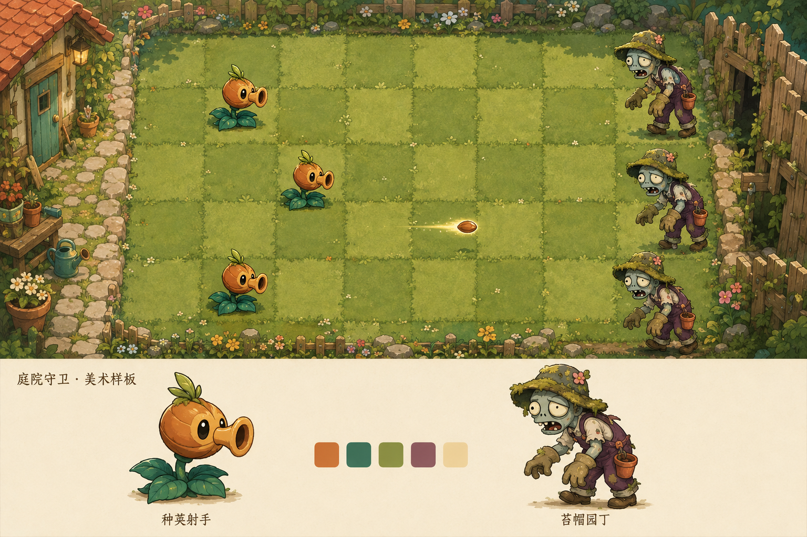

# 庭院塔防美术小样 v1

日期：2026-09-07。

## 本次交付

已使用内置 ImageGen 生成一张视觉样板，保存为 `art-source/concepts/garden-style-board-v1.png`。该图用于风格讨论，不是游戏运行截图，也不是可直接导入的角色图集。本轮未编写游戏代码。



## 暂定美术方向

- 风格：手绘卡通，暖色深描边，轻微纸张和颜料质感。
- 场景：阳光庭院，左侧小屋、右侧木栅栏入口，战斗区保持空旷。
- 植物：种荚射手，橙色种荚头、深绿色叶片、朝右发射种子。
- 敌人：苔帽园丁，低饱和肤色、旧园艺服和苔藓帽、朝左移动。
- 色彩关系：植物更暖、更鲜明；敌人偏灰；草坪避免抢过角色。
- 名称属于工作名称，尚未锁定游戏品牌或最终角色名。

## 目视检查结果

样板包含庭院布局、角色近景、战斗尺寸示意和色板，中文角色标签可读，场景中角色与近景基本一致。

实际输出为 1536×1024 的概念板，包含下方角色参考区，并非要求的 16:9 游戏背景。没有把生成图中的格子数量或位置视为准确坐标；正式场景将在 1280×720 工作画布中重新校准 5×9 棋盘。生成图中的角色、投射物和背景目前已合并，尚无透明部件、碰撞范围或动画数据。

## 下一步制作范围

风格确认后，先从这张图派生一株植物、一个敌人和一张无角色场景，不批量生成全部角色：

1. 种荚射手：透明背景标准立绘，向右，完整叶片和脚底；再准备头部、茎叶和种子部件。
2. 苔帽园丁：透明背景标准立绘，向左，完整帽子和四肢；再准备头、躯干、手臂和腿部。
3. 庭院背景：横屏 16:9，移除角色、投射物、文字和下方参考区；保留可布置准确棋盘的空旷草坪。
4. 动作规划：植物待机与后坐，敌人行走与啃食。先验证小尺寸可读性和部件连接，再制作帧或动画。

音视频仍按路线文档安排，尚未连接新的生成服务。下一阶段接入音频、视频服务前需确定实际提供商及可用账户，不能将本次图片生成视为这些服务已经可用。

## 生成记录

- 方法：内置 `image_gen` 工具；未使用 CLI 或 API 密钥。
- 输入参考：无，从文字生成。
- 模型具体版本：工具结果未提供，不作推断。
- 原始文件：`C:/Users/180841/.codex/generated_images/01a079d3-9619-75a2-a021-00e94bc99ade/exec-67b63cab-20fd-43a6-952d-178c42f2eda4.png`。
- 后处理：只复制到项目目录，没有修改像素。
- 当前状态：画风已由用户确认，已继续生成独立角色和场景母版，见 `docs/2026-09-07-first-asset-pack.md`。
- 下方保留实际提交的英文提示原文，便于复现和后续编辑。

## 最终提示原文

```text
Use case: stylized-concept.
Asset type: original 2D lane-defense game art direction board, for a Chinese-language game project, concept approval only.
Primary request: Create ONE polished landscape visual development board combining an original plant defender, an original cartoon zombie enemy and a usable-looking garden battlefield. The game should feel cheerful, funny and immediately readable like a classic garden lane-defense game, while every character and illustration is newly designed.
Composition: very wide landscape board, approximately 16:9. Upper 65 percent is a large in-game visual concept: fixed orthographic slightly overhead garden with FIVE horizontal lanes and NINE planting columns, evenly rectangular not isometric. Left edge a small warm garden shed and stone border, right edge an entrance through an overgrown wooden fence. Play area dominates, with clear muted green grass tiles and restrained flower borders. Place three small instances of the plant in left/middle columns and three small enemy instances entering from the right. Leave most tiles empty so gameplay remains legible. Show a small glowing seed projectile in one row. No HUD or text across the battlefield, no health bars or fake clickable controls.
Lower 35 percent is a cream-colored reference strip with two separated spacious character studies and a compact 5-color swatch strip. Left character study: one full-body original seed-shooting plant facing right, chestnut-shaped warm orange seedpod head with a flared petal nozzle, expressive dark eyes, teal-green leaves as a stable foot base, short stem, tiny leaf crest. A clear compact silhouette, head and leaves visually separable for future cutout animation. Right character study: one full-body funny non-gory garden zombie facing left, desaturated blue-gray skin, asymmetric drooping eyelids, oversized gardening gloves, faded plum patchwork overalls, rolled trouser cuffs, floppy moss-covered gardening hat, a small terracotta pot hanging from its belt. Hunched but friendly-comic, head/torso/arms/legs visually separable for future animation. The character designs in the large battlefield must match these exact reference studies.
Style: premium indie game hand-painted 2D cartoon artwork, clean substantial warm dark outlines, softly shaded flat color areas, subtle gouache texture only in larger shapes, tactile charm. Readable silhouettes at small size. Warm sunlight from upper left. Restrained warm grass green, teal leaf, apricot orange, dusty plum, cream palette. Plants warm/saturated, enemies cooler/desaturated, background quieter than actors.
Text: only small neat Simplified Chinese labels in the lower strip: "庭院守卫 · 美术样板" and under the plant "种荚射手" and under the enemy "苔帽园丁". All other areas contain no text.
Constraints: no logos, no watermark, no existing game screenshots or assets, no copied signature character silhouettes or costumes. No photorealism, no 3D render, no cinematic perspective, no gore, no huge foreground objects covering the grid. This is an art direction illustration, not a real running game or a final sprite atlas.
```
